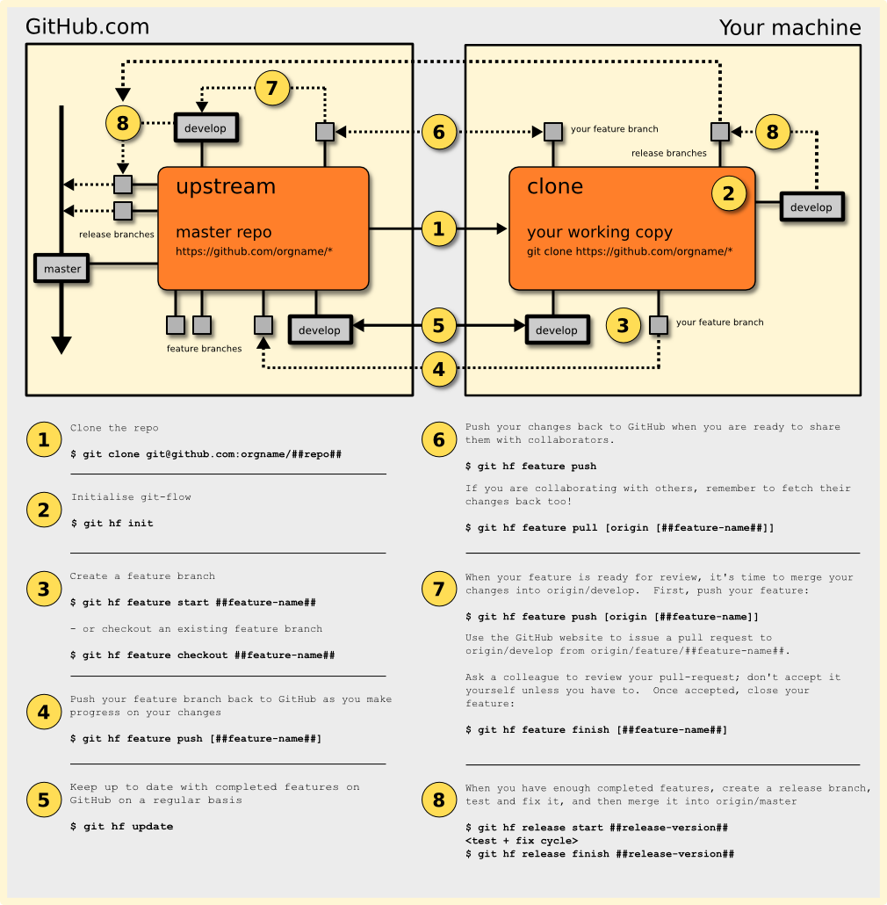

# Using GitFlow With GitHub #

## Introduction ##

This is our recommended workflow for using:

* [The GitFlow branching model](http://nvie.com/posts/a-successful-git-branching-model/)
* \+ [our fork of the GitFlow tools](https://github.com/datasift/gitflow)
* \+ [https://github.com](GitHub)

together.  We're assuming you've already looked at stock GitFlow.  If you haven't, please first read:

* [GitFlow](http://nvie.com/posts/a-successful-git-branching-model/)
* [Introducing GitFlow](http://datasift.github.com/gitflow/IntroducingGitFlow.html)

## The Poster ##

## 1. Cloning A Repo ##

Clone the existing repo from GitHub:


git clone git@github.com:##orgname##/##reponame##


Please remember:

* Do not fork the repo on GitHub - clone the master repo directly.

## 2. Initialise GitFlow Tools ##

The GitFlow tools need to be initialised before they can be used:


git branch master origin/master
git flow init -d


You have to do this every time you clone a repo.

## 3. Create A Feature Branch ##

If you are creating a new feature branch, do this:


git flow feature start -F ##feature-name##


If you are starting to work on an existing feature branch, do this:


git flow feature checkout ##feature-name##


## 4. Create Feature Branch On GitHub ##

Push your feature branch back to GitHub to make sure that it exists in the master repo:


git flow feature publish ##feature-name##


If the feature branch already exists on the master repo, this command will fail with an error.

## 5. Keep Up To Date ##


git flow update


## 6. Collaborate With Others ##


git flow feature push



git flow feature pull


## 7. Merge Your Feature Into Develop Branch ##


git flow feature push


Then, use the GitHub website to create a pull request to ##reponame##/develop branch from ##reponame##/feature/##feature-name##.

Ask a colleague to review your pull-request; don't accept it yourself unless you have to.  Once the pull request has been accepted, close your feature using the GitFlow tools:


git flow feature finish -F


## 8. Creating Releases ##

When you have enough completed features, create a release branch:


git flow update
git flow release start ##release-version##


Build the code, deploy it into test environments, find bugs.  Fix the bugs directly inside the release branch.  Keep building, deploying, debugging, fixing until you're happy that the release is ready.

When you're ready to tag the release and merge it back into master and develop branches, do this:


git flow release finish -p ##release-version##
