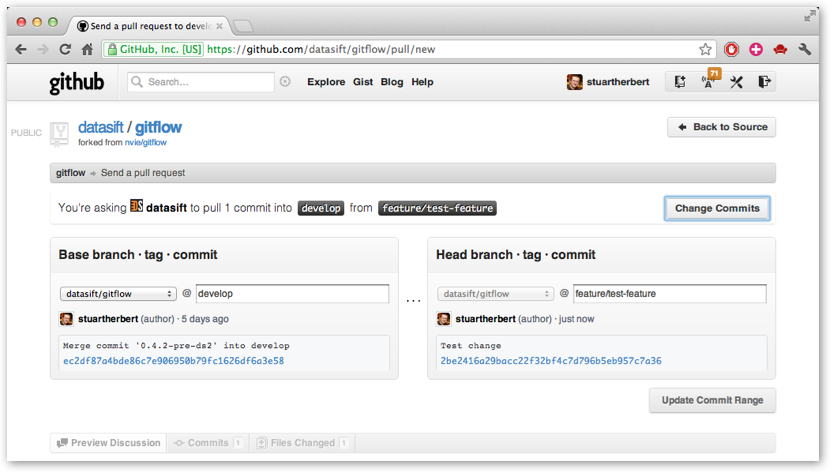
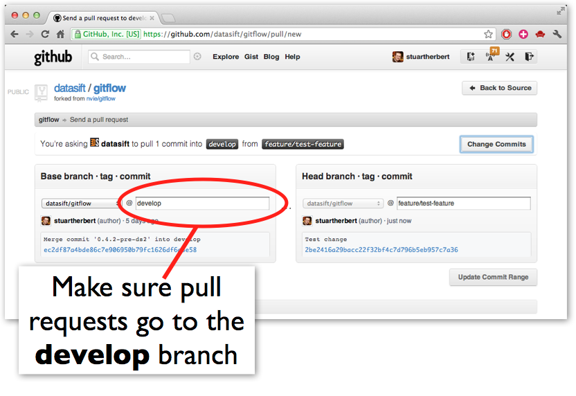
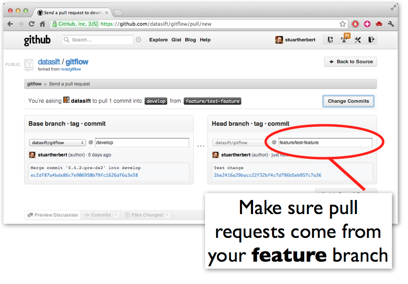
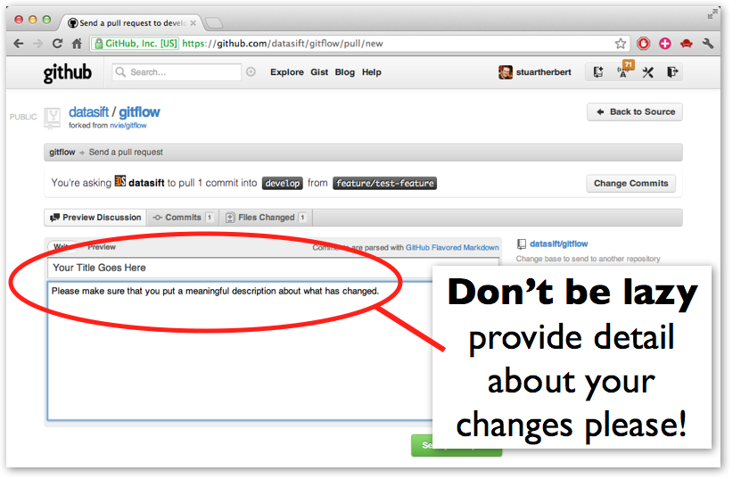
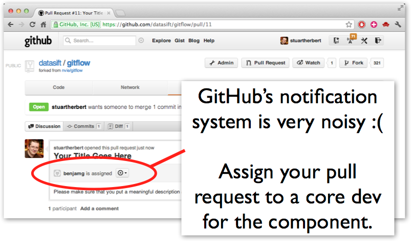

# Using GitFlow With GitHub #

## Introduction ##

This is our recommended workflow for using:

* [The GitFlow branching model](http://nvie.com/posts/a-successful-git-branching-model/)
* \+ [HubFlow, our fork of the GitFlow tools](https://github.com/datasift/gitflow)
* \+ [GitHub](https://github.com)

together.  We're assuming you've already looked at stock GitFlow, and understand the concepts of __feature branches__, __release branches__, __hotfixes__, __releases__ and the __develop branch__.  If you haven't, please first read:

* [GitFlow](http://nvie.com/posts/a-successful-git-branching-model/) (Vincent Driessen's original blog post)
* [Introducing GitFlow](http://datasift.github.com/gitflow/IntroducingGitFlow.html) (our own introduction to GitFlow)

## The Poster ##

[Original SVG file](GitFlowWorkflowNoFork.svn). Created in Inkscape.

The key points are:

* Don't fork repos on GitHub - clone the master repo directly
* Push feature branches back to origin repo so others can collaborate
* Use the GitHub website to create pull requests from feature branches
* Don't accept your own pull requests!

## 1. Cloning A Repo ##

Clone the existing repo from GitHub to your local workstation:


git clone git@github.com:##orgname##/##reponame##


Please remember:

* Do not fork the repo on GitHub - clone the master repo directly.

## 2. Initialise The HubFlow Tools ##

The HubFlow tools need to be initialised before they can be used:


cd ##reponame##
git hf init


Please remember:

* You have to do this every time you clone a repo.

## 3. Create A Feature Branch ##

If you are creating a new feature branch, do this:


git hf feature start ##feature-name##


If you are starting to work on an existing feature branch, do this:


git hf feature checkout ##feature-name##


Please remember:

* All new work (new features, non-emergency bug fixes) __must__ be done in a new feature branch.
* Give your feature branches sensible names.  If you're working on a ticket, use the ticket number as the feature branch name (e.g. ticket-1234).
* If the feature branch already exists on the master repo, this command will fail with an error.

## 4. Publish The Feature Branch On GitHub ##

Push your feature branch back to GitHub as you make progress on your changes:


git hf feature push [##feature-name##]


## 5. Keep Up To Date ##

You'll need to bring down completed features & hotfixes from other developers, and merge them into your feature branch regularly.  (Once a day, first thing in the morning, is a good rule of thumb).


# if you're not on your feature branch
git hf feature checkout ##feature-name##

# pull down master and develop branches
git hf update

# merge develop into your feature branch
git merge develop


## 6. Collaborate With Others ##

Push your feature branch back to GitHub whenever you need to share your changes with colleagues:


git hf feature push


Pull your colleague's changes back to your local clone:


git hf feature pull


## 7. Merge Your Feature Into Develop Branch ##


git hf feature push


Then, use the GitHub website to create a pull request to ##reponame##/develop branch from ##reponame##/feature/##feature-name##.

Ask a colleague to review your pull-request; don't accept it yourself unless you have to.  Once the pull request has been accepted, close your feature using the HubFlow tools:


git hf feature finish


## 8. Creating Releases ##

When you have enough completed features, create a release branch:


git hf update
git hf release start ##version-number##


Release branches are given version numbers for name.  For example:


git hf release start 2.6.0


creates the branch __release/2.6.0__.

Once you've created the release branch, __remember to update the version number in your code__ (in the pom.xml, Makefile, build.xml or wherever it is stored).

Build the code, deploy it into test environments, find bugs.  Fix the bugs directly inside the release branch.  Keep building, deploying, debugging, fixing until you're happy that the release is ready.

When you're ready to tag the release and merge it back into master and develop branches, do this:


git hf release finish ##version-number##


This closes the release branch and creates a tag called ##version-number## against the __master branch__.