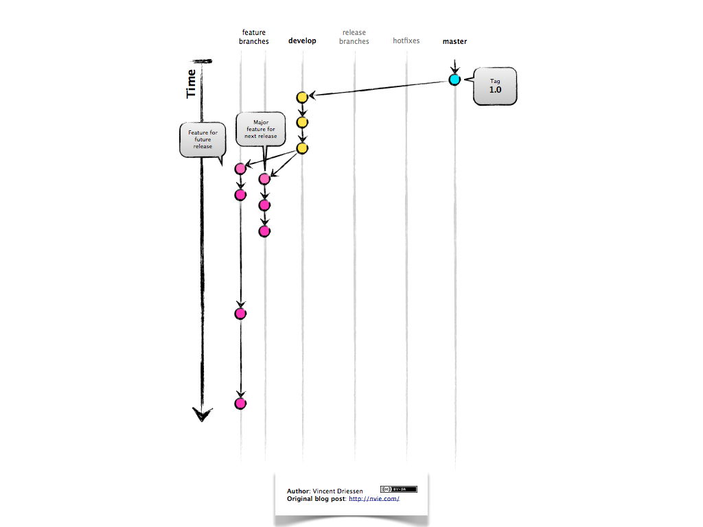
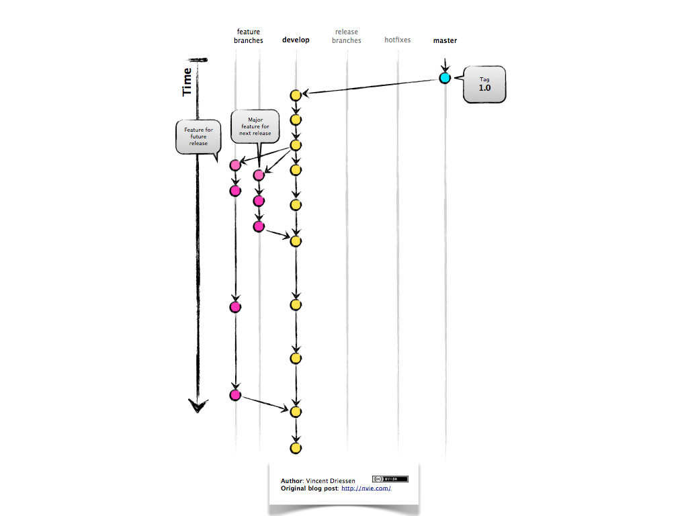
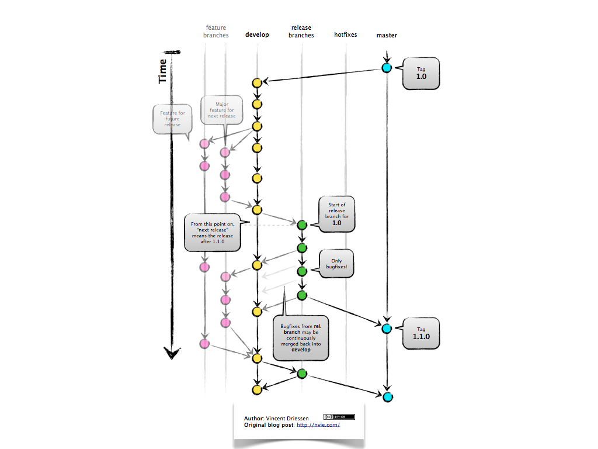
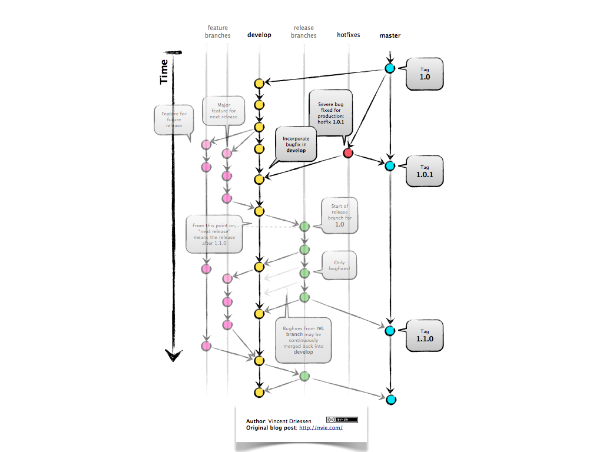

# Introducing GitFlow

## What Is GitFlow?

[GitFlow](http://nvie.com/posts/a-successful-git-branching-model/) is a branching model for Git, created by Vincent Driessen.  It has attracted a lot of attention because it is very well suited to collaboration and scaling the development team.

## Key Benefits

### Parallel Development

One of the great things about GitFlow is that it makes parallel development very easy, by isolating new development from finished work.  New development (such as features and non-emergency bug fixes) is done in __feature branches__, and is only merged back into main body of code when the developer(s) is happy that the code is ready for release.

Although interruptions are a BadThing(tm), if you are asked to switch from one task to another, all you need to do is commit your changes and then create a new feature branch for your new task.  When that task is done, just checkout your original feature branch and you can continue where you left off.

### Collaboration

Feature branches also make it easier for two or more developers to collaborate on the same feature, because each feature branch is a sandbox where the only changes are the changes necessary to get the new feature working.  That makes it very easy to see and follow what each collaborator is doing.

### Release Staging Area

As new development is completed, it gets merged back into the __develop branch__, which is a staging area for all completed features that haven't yet been released.  So when the next release is branched off of __develop__, it will automatically contain all of the new stuff that has been finished.

### Support For Emergency Fixes

GitFlow supports __hotfix branches__ - branches made from a tagged release.  You can use these to make an emergency change, safe in the knowledge that the hotfix will only contain your emergency fix.  There's no risk that you'll accidentally merge in new development at the same time.

## How It Works

New development (new features, non-emergency bug fixes) are built in __feature branches__:

Feature branches are branched off of the __develop branch__, and finished features and fixes are merged back into the __develop branch__ when they're ready for release:

When it is time to make a release, a __release branch__ is created off of __develop__:

The code in the __release branch__ is deployed onto a suitable test environment, tested, and any problems are fixed directly in the release branch.  This __deploy -> test -> fix -> redeploy -> retest__ cycle continues until you're happy that the release is good enough to release to customers.

When the release is finished, the __release branch__ is merged into __master__ **and** into __develop__ too, to make sure that any changes made in the __release branch__ aren't accidentally lost by new development.

The __master branch__ tracks released code only.  The only commits to __master__ are merges from __release branches__ and __hotfix branches__.

__Hotfix branches__ are used to create emergency fixes:

They are branched directly from a tagged release in the __master branch__, and when finished are merged back into both __master__ and __develop__ to make sure that the hotfix isn't accidentally lost when the next regular release occurs.
